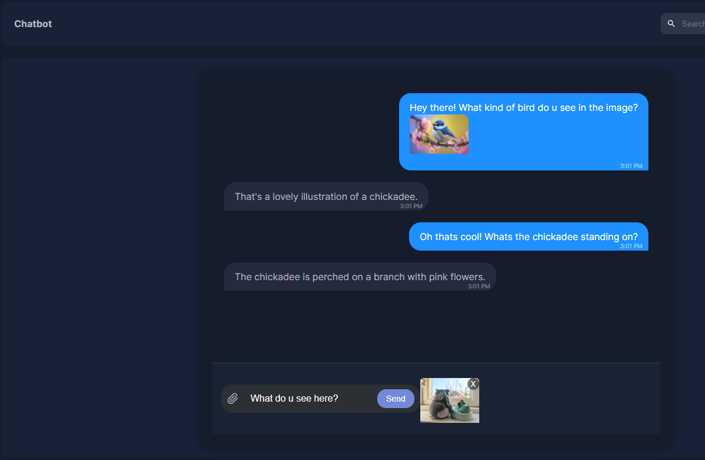
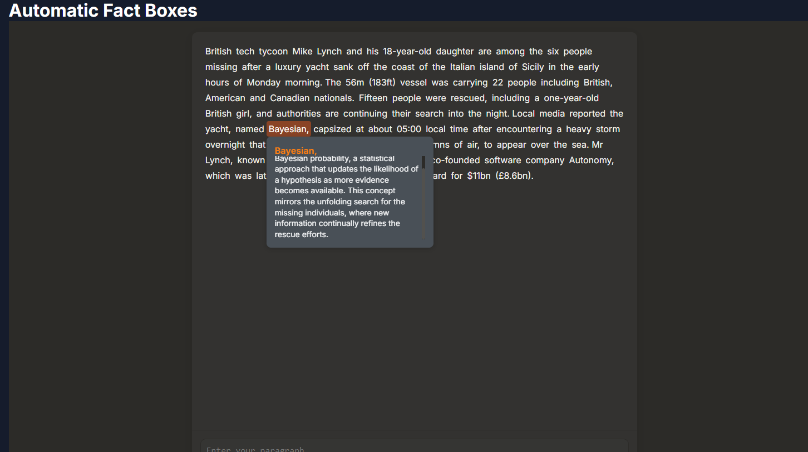

# Next.JS AI Toolkit App with with soon to be many AI Apps you can use!

Welcome to my Next.JS AI project. This project makes use of the latest AI capabilities from several different AI vendors, such as Open AI, Claude (soon) and Gemini (Soon).

Heres a video demo if you'd like to give it a watch 😊 https://www.youtube.com/watch?v=KmD1zz7XGdE&list=PLsd8JCl3SKZGuzqDtcoxtp64S2R8LyCyU&index=3

## Features

- **For examples, see the screenshots section down below :)**
- **Open AI:**
  - Dashboard
  - Chatbot (gpt4-o)
  - Location AI (gpt4-o, leaflet)
  - Image Generation (DALL·E 2 & 3) (Honestly the difference in imagination and well, general imagery is so much better in dall-e 3, try it out)
- **Claude:**
  - Text-To-Speech Chatbot (Using Anthropics latest model, Claude-3.5-Sonnet, and an AI generated voice from Resemble AI)
  - Automatic Factboxes (Uses Claude-3.5-Sonnet to generate a fact based on the article or paragraph written)
- **Gemini:**
  - Soon...
  - Soon...

## Technologies Used

- **[Next.js](https://nextjs.org/) :** Frontend framework for building server-side rendered and static web applications.
- **[React](https://react.dev/) :** JavaScript library for building user interfaces.
- **[Node.js](https://nodejs.org/en) :** JavaScript runtime built on Chrome's V8 JavaScript engine.
- **[Leaflet](https://leafletjs.com/) :** Open-source JavaScript library for mobile-friendly interactive maps.
- **[Tailwind CSS](https://tailwindcss.com/) :** Utility-first CSS framework for styling.
- **[OpenAI](https://openai.com/) :** Integration for AI-powered features.
- **[Claude AI](https://www.anthropic.com/) :** AI model by Anthropic for natural language processing tasks.
- **[Google Gemini](https://gemini.google.com/) :** Google's multimodal AI model for various AI tasks. (soon)
- **[Resemble AI](https://www.resemble.ai/) :** Resemble AI delivers cutting-edge Generative AI Voices.

## Screenshots

### Dashboard


### Chatbot with image recognition:



### Location AI - Finds location based on an abstract query and shows it on the map:


### Image Generation- Generates an image using OpenAi's DALL·E 2 or 3 model.


### Text-To-Speech Chatbot - Chatbot with an AI generated voice to read out responses. Can also read previous responses. Voice comes from Resemble AI, cloning a video game characters voice (Tarkos).


### Automatic Factboxes - Generate a factbox by clicking on any word, and you will recieve one based on the article or paragraph submitted. Analysis and facts are generated by Claude-3.5-Sonnet



### Soon to be more..

## Getting Started

To get a local copy up and running follow these simple steps:

### Installation

1. **Clone the repository:**

```shell
 git clone https://github.com/alexandurrr/nextjsAI.git
 cd nextjsAI
```

2. **Install dependencies:**

```shell
 npm install
 # or
 yarn install
```

### Configuration

1. **Create a `.env.local` file in the root directory of the project.**
2. **Add your API keys to the `.env.local` file:**

```shell
OPENAI_API_KEY=YOUR_API_KEY_HERE
ANTHROPIC_API_KEY=YOUR_API_KEY_HERE
RESEMBLE_API_KEY=YOUR_API_KEY_HERE
RESEMBLE_PROJECT_UUID=YOUR_API_KEY_HERE
RESEMBLE_VOICE_UUID=YOUR_API_KEY_HERE
```

**You can generate your API keys at [OpenAI](https://openai.com/index/openai-api/), [Claude](https://www.anthropic.com/api) and [ResembleAI](https://www.resemble.ai/) websites.**

### Running the Application

1. **Start the development server:**

```bash
npm run dev
# or
yarn dev
# or
pnpm dev
# or
bun dev
```

**Open [http://localhost:3000](http://localhost:3000) in your browser to view the application.**
