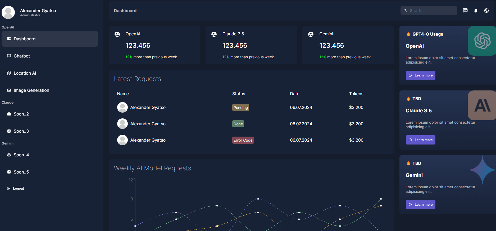
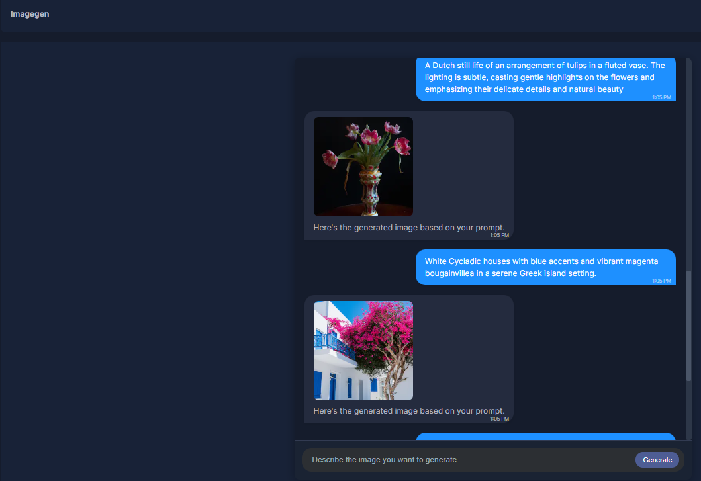

# Next.JS AI Toolkit App with with soon to be many AI Apps you can use!

Welcome to my Next.JS AI project. This project makes use of the latest AI capabilities from several different AI vendors, such as Open AI, Claude (soon) and Gemini (Soon).

This is a [Next.js](https://nextjs.org/) project bootstrapped with [`create-next-app`](https://github.com/vercel/next.js/tree/canary/packages/create-next-app).

## Features

- **For examples, see the screenshots section down below :)**
- **Open AI:**
  - Dashboard
  - Chatbot (gpt4-o)
  - Location AI (gpt4-o, leaflet)
  - Image Generation (DALL·E 2 & 3)
- **Claude:**
  - Soon...
  - Soon...
- **Gemini:**
  - Soon...
  - Soon...

## Technologies Used
- **[Next.js](https://nextjs.org/) :** Frontend framework for building server-side rendered and static web applications.
- **[React](https://react.dev/) :** JavaScript library for building user interfaces.
- **[Node.js](https://nodejs.org/en) :** JavaScript runtime built on Chrome's V8 JavaScript engine.
- **[Leaflet](https://leafletjs.com/) :** Open-source JavaScript library for mobile-friendly interactive maps.
- **[Tailwind CSS](https://tailwindcss.com/) :** Utility-first CSS framework for styling.
- **[OpenAI](https://openai.com/) :** Integration for AI-powered features.
- **[Claude AI](https://www.anthropic.com/) :** AI model by Anthropic for natural language processing tasks. (soon)
- **[Google Gemini](https://gemini.google.com/) :** Google's multimodal AI model for various AI tasks. (soon)

## Screenshots

### Dashboard (


### Chatbot with image recognition:


### Location AI - Finds location based on an abstract query and shows it on the map:


### Image Generation- Generates an image using OpenAi's DALL·E 2 or 3 model.


### Soon to be more..

## Getting Started

To get a local copy up and running follow these simple steps:

### Installation

1. **Clone the repository:**
  ```shell
   git clone https://github.com/alexandurrr/nextjsAI.git
   cd nextjsAI
  ```

2. **Install dependencies:**
  ```shell
   npm install
   # or
   yarn install
  ```
### Configuration
1. **Create a ```.env.local``` file in the root directory of the project.**
2. **Add your OpenAI API key to the ```.env.local``` file:**
  ```shell
  OPENAI_API_KEY=your_openai_api_key_here
  ```
   **You can generate an API key at [OpenAI's](https://platform.openai.com/api-keys) website.**

### Running the Application
1. **Start the development server:**
```bash
npm run dev
# or
yarn dev
# or
pnpm dev
# or
bun dev
```

**Open [http://localhost:3000](http://localhost:3000) in your browser to view the application.**
